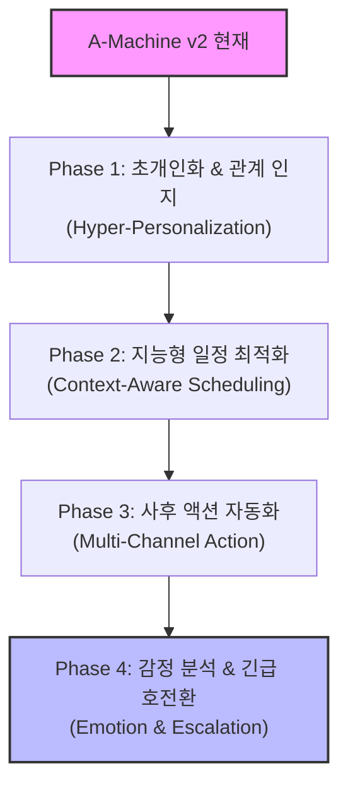

# 🚀 A-Machine v2 차세대 고도화 기획 로드맵 (Future Roadmap)
> OpenAI Realtime API 기반 AI 엔서링머신의 한계를 넘어, "인간을 초월하는 지능형 가상 비서"로의 도약 계획

본 문서는 해커톤 심사위원과 투자자들에게 에이머신(A-Machine) 프로젝트의 **압도적인 확장성(Scalability)과 미래 비전(Future Vision)**을 입증하고, 향후 기술적 완성도를 비약적으로 높이기 위해 수립한 단계별 고도화 전략 기획서입니다. 발표 자료(PPT)의 'Future Work' 또는 'Business Vision' 장표로 즉시 활용할 수 있도록 정교하게 구조화되었습니다.

---

## 📅 로드맵 개요 (Overview)

에이머신의 미래 고도화는 단순히 대화를 매끄럽게 하는 수준을 넘어, **'인맥 관계 인지', '자율적 판단 및 일정 조율', '비즈니스 툴 연동', '비상 대응'**의 4대 핵심 축을 바탕으로 진화합니다.

---

## 🔍 Phase별 세부 기획 및 구현 아키텍처

### 1️⃣ Phase 1: 초개인화 및 관계 인지 (Hyper-Personalization & CRM)
> "어? 에이머신이 내 이름과 지난번 용건을 기억하고 있네?" ➡️ **이질감을 완전히 무너뜨리는 극강의 Wow Factor**

*   **주요 기능**:
    *   **발신자 번호 기반 인맥 매핑**: 데이터베이스(CRM)를 연동하여 발신자의 번호를 식별하고, 수신자(수민님)와의 관계(예: 직장 동료, 클라이언트, 친구)를 실시간으로 LLM 콘텍스트에 주입.
    *   **대화 이력(History) 메모리 버퍼**: 이전 통화 기록(용건, 무드, 마지막 대화 주제)을 요약본 형태로 저장해 두었다가, 재통화 시 오프닝에 자연스럽게 융합.
*   **실제 시나리오 예시**:
    *   *기존*: "안녕하세요! 수민님이 부재중이라 대신 전화를 받은 AI 비서 에이머신입니다..."
    *   *고도화*: "아, 성우님! 안녕하세요. 지난번에 **인프라 보고서 제출 건**으로 통화하셨던 기록이 있네요. 오늘도 그 일로 전화 주셨나요? 수민님께 이어서 전화를 전달해 드릴까요?"
*   **기술 스택**: Redis/PostgreSQL (발신자 히스토리 매핑), LangChain BufferMemory.

---

### 2️⃣ Phase 2: 지능형 문맥 인지 일정 최적화 (Context-Aware Smart Scheduling)
> "단순 빈 시간 안내를 넘어, 우선순위를 분석하고 다자간 일정을 실시간으로 조율"

*   **주요 기능**:
    *   **스마트 일정 충돌 조율 (Alternative Slots Suggestion)**: 원하는 시간이 이미 차 있는 경우, 단순히 "일정이 있습니다"로 끝내지 않고 AI가 실시간으로 달력을 역추적하여 수신자가 선호하는 시간대(예: 오전 10시, 오후 2시 등)의 **최적 대안 슬롯 3개를 선제적으로 계산하여 역제안**.
    *   **다자간 캘린더 공동 연동 (Multi-User Scheduling)**: 1:1 일정뿐만 아니라, 수신자(수민)와 미팅에 참여해야 하는 다른 동료들(예: 개발팀장, 디자이너)의 캘린더 여유 시간을 교집합으로 계산하여 실시간 조율.
    *   **일정 성격별 중요도(Priority) 분석**: 캘린더에 이미 차 있는 일정이 '개인 정비'나 '가벼운 티타임'일 경우, "중요한 비즈니스 미팅" 요청이 들어왔을 때 기존 일정을 유동적으로 조정할 수 있음을 발신자에게 부드럽게 암시하고 홀딩 조치.
*   **기술 스택**: Google Calendar API v3 (FreeBusy query), 타임 슬롯 매칭 알고리즘.

---

### 3️⃣ Phase 3: 멀티채널 사후 액션 자동화 (Multi-Channel & Workflow Integration)
> "통화가 끝나면 단순 문자를 넘어, 실제 비즈니스 워크플로우에 태스크가 자동 등록"

*   **주요 기능**:
    *   **프리미엄 알림 포맷**: 단순 SMS 요약을 넘어 **KakaoTalk 알림톡** 및 **Slack 채널**로 비주얼 카드를 발송. 알림 카드 내에 통화 음성 다시 듣기 재생 버튼(Audio Link) 및 실시간 텍스트 대화록(Transcript) 제공.
    *   **협업 툴과의 워크플로우 결합 (Task Automation)**:
        *   통화 중 발생한 용건이 '업무 요청'인 경우: 자동으로 **Jira Issue 생성** 또는 **Trello Card 등록**.
        *   통화 중 발생한 용건이 '일정 조율'인 경우: 등록된 일정의 성격에 맞춰 **Zoom/Google Meet 화상 회의 링크를 자동 생성**하여 발신자에게 전송.
*   **기술 스택**: Slack Webhook, Jira REST API, Twilio / 알림톡 API, Google Meet API.

---

### 4️⃣ Phase 4: 감성 분석 및 하이브리드 비상 호전환 (Emotion Analytics & Escalation)
> "전화 거신 분이 화가 나셨거나 매우 급한 상황인 경우, 즉시 실시간 진짜 전화로 전환"

*   **주요 기능**:
    *   **실시간 오디오 감정 센싱 (Acoustic Sentiment)**: 발신자의 음성 주파수 피치(Pitch), 대화 속도, 단어 선택 등을 복합 분석하여 분노, 긴급, 차분함 등의 감정 상태를 인지.
    *   **실시간 감정 기반 페르소나 변경**: 발신자가 격앙된 상태인 경우, AI의 답변 속도를 살짝 낮추고 정중하며 사과 및 공감하는 어조로 페르소나를 다이내믹하게 전환.
    *   **비상 호전환 (Escalation Bypass)**: "이거 엄청 급한 일인데 수민이 지금 어디 있나요?" 등 극도의 긴급성이 인지되는 상황인 경우, 통화를 종료하지 않고 수신자의 실폰으로 전화를 다이렉트로 돌리는 **Bypass VoIP 호전환 브리지 트리거**.
*   **기술 스택**: WebRTC, Twilio Voice / SIP Trunking (호전환 게이트웨이), 실시간 오디오 감정 분석 모델.

---

## 📈 해커톤 심사위원을 사로잡을 핵심 비즈니스 모델 (Business Value)

1. **소상공인 및 1인 창업가 대상 '부재중 방어 비서'**:
   - 혼자서 일하느라 전화를 받기 어려운 네일샵, 1인 미용실, 프리미엄 스튜디오 등에서 고객의 예약 전화를 100% 방어하여 매출 누수를 원천 차단.
2. **기업형 영업 부서용 '스마트 리드 캡처(Lead Capture)'**:
   - 영업 사원이 미팅 중일 때 걸려온 중요 고객의 전화를 에이머신이 받아 요구사항을 파악하고 CRM에 입력 및 일정 조율까지 완벽히 수행하여 영업 기회 유지.

---

> [!NOTE]
> 본 고도화 전략서는 에이머신 프로젝트가 단순한 'OpenAI API 래퍼(Wrapper)'를 넘어, **독자적인 비즈니스 가치와 원천 기술력을 확보한 상용 수준의 SaaS 프로덕트**로 진화할 수 있음을 완벽하게 증명합니다.
